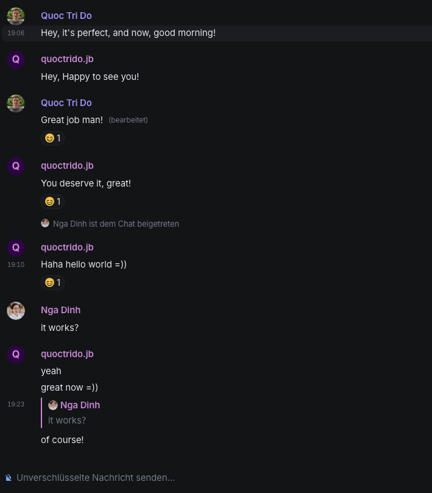
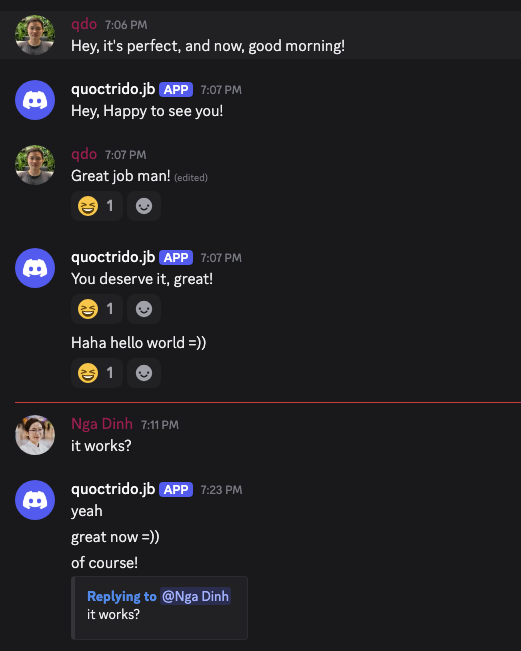
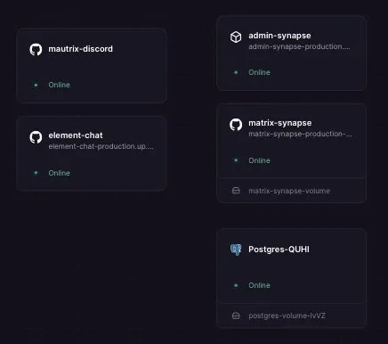
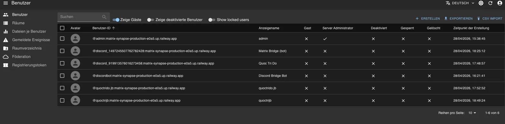
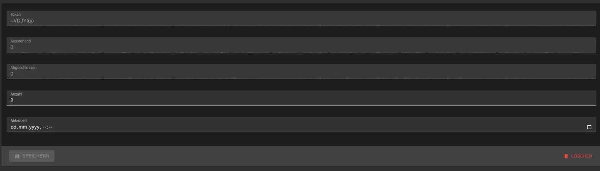

# matrix-discord-bridge

Self-hosted Discord ↔ Matrix bridge on Railway. A step-by-step guide for connecting [Element Web](https://element.io/) with Discord channels via [mautrix-discord](https://github.com/mautrix/discord).

Partners use Element Web to chat. Students use Discord. Messages flow both ways — each user's display name is preserved on both sides.

| Element (Matrix) | Discord |
|:-:|:-:|
|  |  |

## Architecture

```
Partner (browser)                    Student (Discord client)
       │                                      │
       │ HTTPS                                │ WSS
       ▼                                      ▼
┌─────────────┐                       ┌──────────────┐
│ Element Web  │                       │   Discord    │
│ (static SPA) │                       │   (hosted)   │
└──────┬──────┘                       └──────┬───────┘
       │                                      │
       │ REST API                              │
       ▼                                      │
┌─────────────┐    Application Service    ┌───┴──────────┐
│   Synapse    │◄────── HTTP API ────────►│ mautrix-     │
│ (homeserver) │                          │ discord      │
└──────┬──────┘                           └──────────────┘
       │
┌──────┴──────┐
│ PostgreSQL   │
└─────────────┘
```

Everything runs as Docker containers on [Railway](https://railway.app):



## What you get

- **Bidirectional messaging** — messages, files, images, and edits sync between Discord and Element
- **Display names preserved** — Discord users appear as ghost users in Element; Element users appear with their names in Discord via webhooks
- **No config file editing to bridge channels** — just `!discord bridge <channelID>` in Element
- **Web-based admin panel** — manage users, rooms, and registration tokens through Synapse Admin
- **Token-based registration** — partners register with a one-time token, no open signup

## Relay mode limitations

| Feature | Discord → Element | Element → Discord |
|---------|:-:|:-:|
| Messages | ✅ | ✅ |
| Files / images | ✅ | ✅ |
| Message edits | ✅ | ✅ |
| Reactions | ✅ | ❌ |
| Pins | ❌ | ❌ |
| Message deletes | ❌ | ✅ |
| Threads | ✅ | ❌ |

## Guide

Follow the parts in order. Each part depends on the previous one.

| Part | What | Time |
|------|------|------|
| [Part 1: PostgreSQL](discord-matrix/part1.md) | Create the database instance and bridge database |
| [Part 2: Synapse](discord-matrix/part2.md) | Deploy the Matrix homeserver |
| [Part 3: Element Web](discord-matrix/part3.md) | Deploy the web client, create admin account |
| [Part 4: Discord Bot](discord-matrix/part4.md) | Create bot application, get token, add to server |
| [Part 5: mautrix-discord](discord-matrix/part5.md) | Deploy the bridge, connect to Discord, bridge channels |
| [Part 6: Synapse Admin](discord-matrix/part6.md) | Deploy the admin dashboard, set up registration tokens |
| [Part 7: Go Live](discord-matrix/part7.md) | Bridge all channels, onboard partners |

**Reference docs:**
- [Architecture overview](discord-matrix/overview.md) — how the components connect
- [Operations reference](discord-matrix/operations.md) — day-to-day tasks, bridge commands, troubleshooting

## Admin panel

Manage users and registration tokens through a web UI instead of CLI commands.

| Users | Registration tokens |
|:-:|:-:|
|  |  |

## Prerequisites

- A [Railway](https://railway.app) account
- A [GitHub](https://github.com) account (Railway deploys from GitHub repos)
- A Discord server where you have admin permissions
- A terminal with `openssl` and `curl` available

## Services & cost

All services run on Railway. At the time of writing, Railway's Hobby plan ($5/month) is sufficient for a small deployment (a few partners, a handful of bridged channels).

| Service | Source | Notes |
|---------|--------|-------|
| PostgreSQL | Railway managed | Stores Synapse + bridge data |
| Synapse | GitHub repo → Docker | Matrix homeserver |
| Element Web | GitHub repo → Docker | Web client for partners |
| mautrix-discord | GitHub repo → Docker | Bridge service |
| Synapse Admin | Docker image | Admin dashboard (no repo needed) |

## Key decisions

- **Server name is permanent.** The Synapse domain (Railway subdomain) gets baked into every user ID and cryptographic signature. Changing it means rebuilding everything. See [migration notes](discord-matrix/operations.md#migrate-to-a-real-domain-later).
- **Relay mode for Element → Discord.** All Element users' messages go through a Discord webhook. This preserves display names but limits some features (see table above).
- **mautrix-discord v0.7.x** changed how bot authentication works. The Discord token is provided via a chat command (`login-token bot`), not via config file. The guide accounts for this.
- **Registration tokens** instead of toggling registration on/off. Partners get a one-time token to sign up. Managed through the Synapse Admin UI.

## License

This guide is provided as-is for educational purposes.